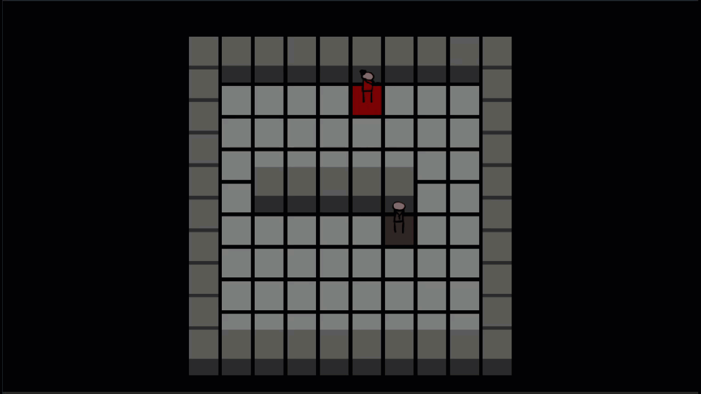

This project is a contribution for CodinGame, a shortest path problem of a solo game using the [Game Engine Toolkit](https://www.codingame.com/playgrounds/25775/codingame-sdk-documentation/introduction) of [CodinGame](https://www.codingame.com/).

# The Game

You are currently trapped in a weird place with a random person, who seems SUSpicious and tries to keep a distance between you and him. You have to find him and ask what is going on. Try to navigate yourself through the obstacles to catch up with the moving sus man.

# Rules

The map is a $10 \times 10$ board, where each grid block is either a wall block or a floor block. Each character, you and the sus man, can only move in 4 directions—straight UP, DOWN, LEFT, RIGHT. In each turn, a legal move is to move in those 4 directions for 1 block length without end up going inside a wall block or going out of the map border.

# Initialization Input

Before you take the first turn, you are given an input of $11$ lines. The first line is an integer $K$ representing after how many turns the sus man will make another move. The next $10$ lines are a $10 \times 10$ two-dimensional char array. $'*'$ represents a wall block and other characters represent a floor block. The uppercase characters $'P'$ represent your spawning location while the lowercase letters, and $'E'$ represent the sus man’s spawning location (the letters also indicate the person’s facing direction, but they are just for looks and do not matter in solving this game).

# Input For a Game Turn

At the start of each turn, you receive an input containing $2$ integers in the same line, $eneY$ and $eneX$, representing the sus man’s coordinate. If the sus man is at the upper-left corner of the map, both $eneY$ and $eneX$ should have the value $0$. If sus man goes $DOWN$ for a block length, $eneY$ will increase for $1$. If sus man goes RIGHT for a block length, $eneX$ will increase for $1$.

The sus man will make a move in response to your move, but with a cold down. $K$ turns after the sus man’s last move sus man will make another move. In the first turn, sus man always makes a move. When sus man makes a move, he stays STILL or goes UP, DOWN, LEFT, or RIGHT for a distance of $1$ block.

# Output

To end a turn, you should output an uppercase character from 'U', 'D', 'L', 'R' to indicate your move of respectively going UP, DOWN, LEFT, or RIGHT for a distance of 1 block length.

# Wrong Output

After you make the move you are standing inside a floor block, or being out of bound (in this case your x or y coordinate is negative or strictly greater than 9).
Not outputting a character which is uppercase 'U', 'D', 'L', 'R'.

# Expert Rules

The algorithm for the sus man is dumb, and there is always a way to catch up.

# Victory Conditions

After you make the move of the turn (at the time the sus man has not responded yet), the current floor block you are on has a shared side with the sus man’s current floor block.

# Loss Conditions

- Exceed the turn limit of $100$.
- 

# Constraints

$0 < eneY < 10$ ` `
$0 < eneX < 10$ ` `
$0 < K < 100$ ` `

